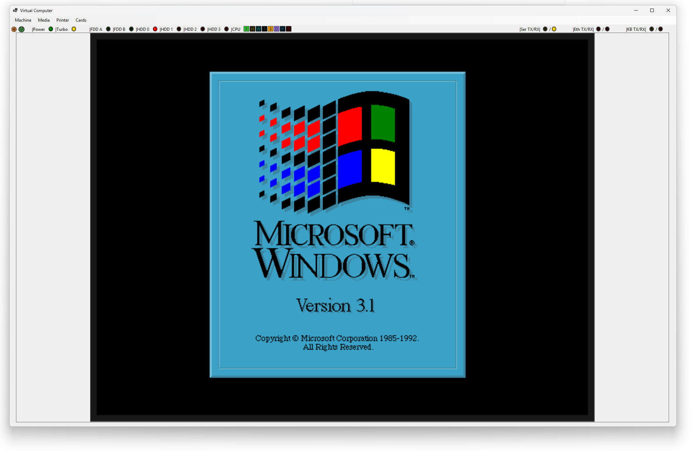
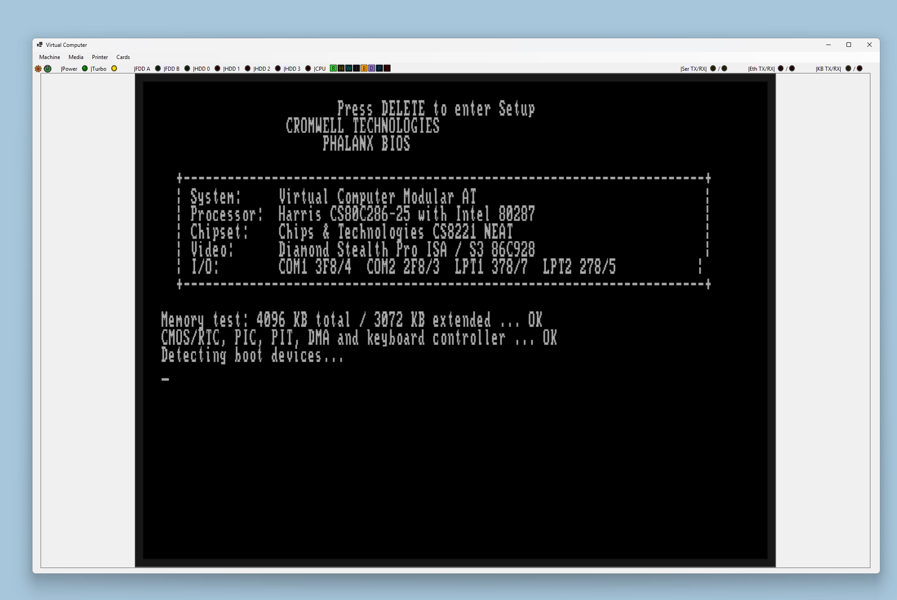
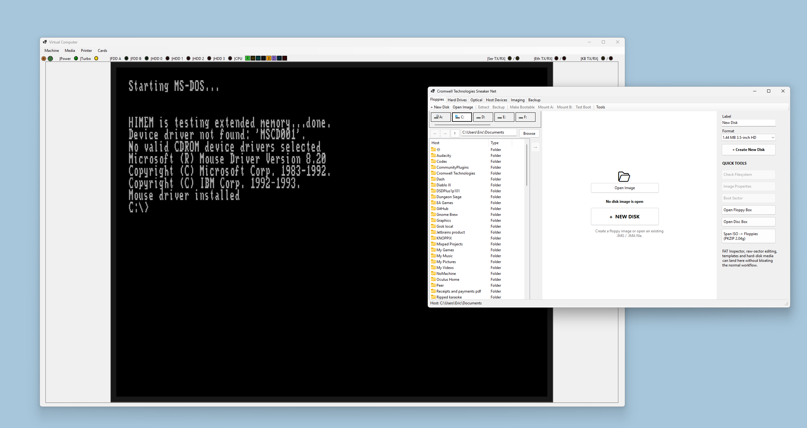
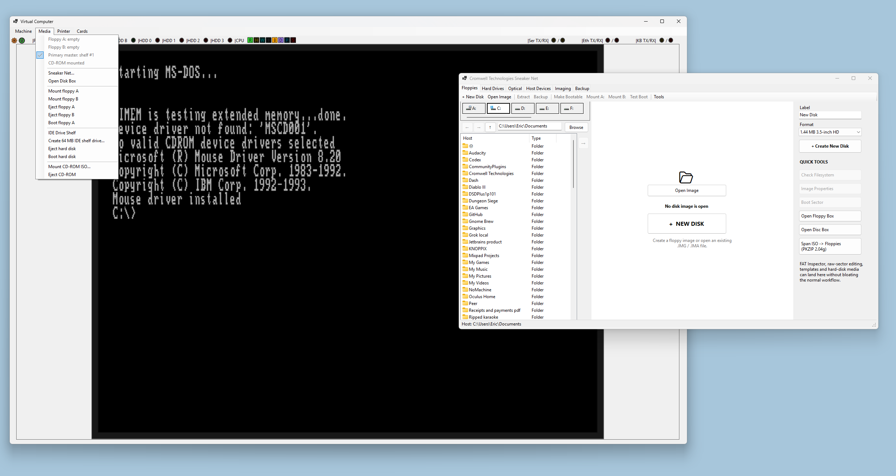
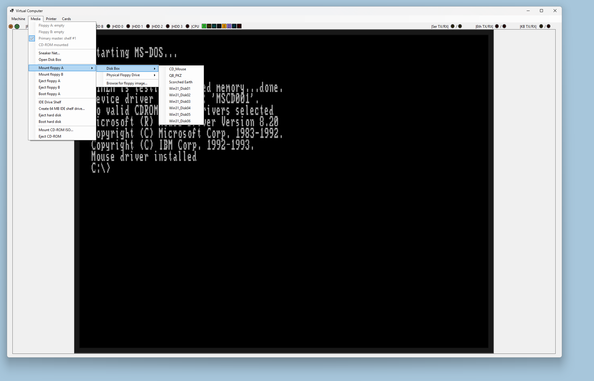
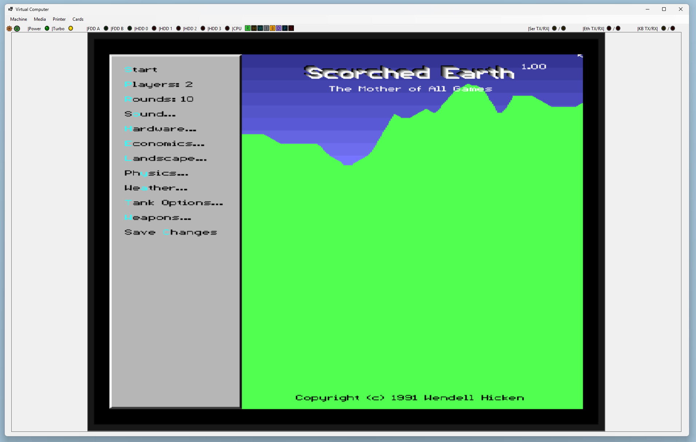
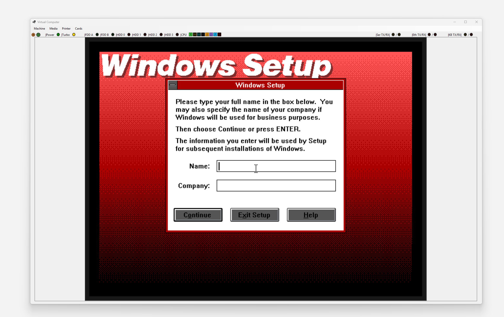
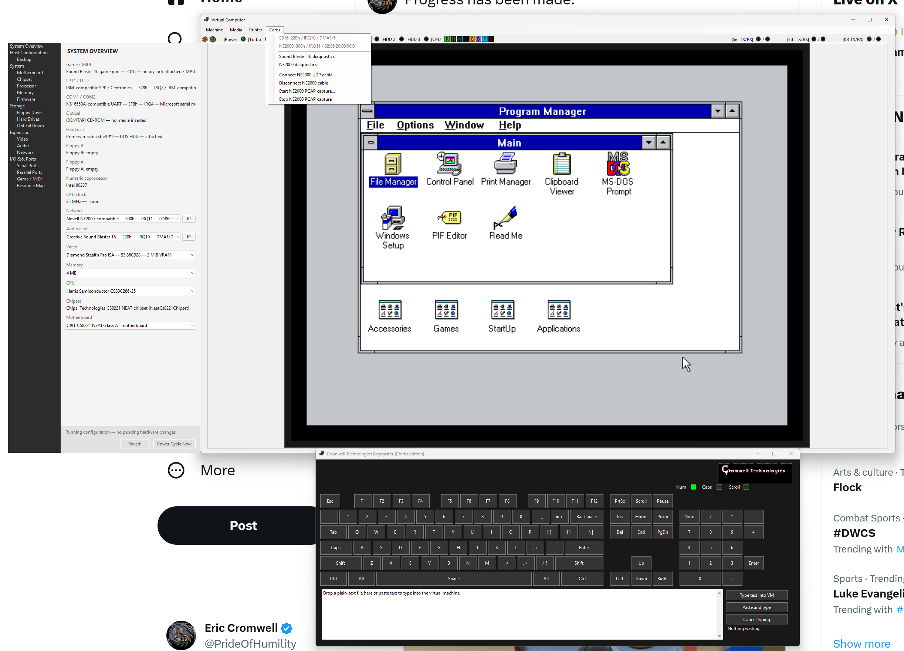

# Virtual Machine Bench

Virtual Machine Bench is a hardware-oriented IBM AT-class emulator written in VB.NET. The project models a late 80286-era system as a collection of devices connected through the machine's buses, with an emphasis on guest-visible hardware behavior rather than application-level shortcuts.

The current milestone boots MS-DOS and runs Microsoft Windows 3.1 in Standard Mode on the emulated Diamond Stealth Pro / S3 86C928 video hardware.



## Feature suite

Hardware configuration, I/O decoding, DMA, interrupt routing, memory transactions, and guest communication are intended to pass through the emulated buses and devices. Host conveniences attach at the edge of those devices instead of replacing the hardware path.

### Processor and system board

- Harris Semiconductor CS80C286-25 profile with normal and Turbo clock operation
- 80286 real-address and protected-mode execution, descriptor tables, privilege checks, gates, task-state handling, exceptions, interrupt shadows, protected-mode return paths, and 286 `LOADALL`
- Intel 80287 numeric coprocessor with its own stack, tag, control, status, exception, rounding, arithmetic, comparison, conversion, and transcendental state
- C&T CS8221 NEAT-class AT motherboard model
  - 82C211 CPU/AT-bus-controller role
  - 82C212 memory, shadow, and EMS-controller role
  - 82C206 integrated peripheral role
  - 82C215 data/address-buffer role represented in motherboard routing
  - indexed chipset configuration through ports 22h/23h
- AT bus arbitration, HOLD/HLDA behavior, ready/wait-state classes, mapped-memory cycles, port cycles, and reset routing
- Configurable 1, 2, 4, 8, 12, or 16 MiB RAM with A20, ROM, shadow, and legacy-memory decoding
- Cascaded 8259-compatible interrupt controllers, 8237-compatible DMA controllers, 8253-compatible timer, RTC/CMOS, NMI, and AT system-control ports
- Custom AT system BIOS and boot support for floppy or hard disk

### Video

- Diamond Stealth Pro ISA card model with S3 86C928 accelerator and 2 MiB VRAM
- VGA-compatible sequencer, CRTC, graphics controller, attribute controller, DAC/palette, latches, planar/packed memory behavior, and banked apertures
- S3 extended registers and accelerator command path used by compatible software
- Card option ROM with VGA BIOS services, mode programming, fonts, palette handling, and VBE-facing support
- Text, EGA/VGA planar, chain-4/Mode 13h, and higher-resolution packed-pixel scanout paths
- CRTC-derived scanout timing and retrace/status behavior
- Asynchronous presentation worker and efficient host-bitmap CRT presentation with aspect-preserving scaling

### Storage and removable media

- NEC uPD765A / Intel 8272-compatible floppy controller at the AT ports, IRQ6, and DMA2
- Two independently attachable floppy drives with seek, recalibrate, read ID, read/write data, deleted-data, sense, and version commands
- Raw floppy-image support for 160K, 180K, 320K, 360K, 720K, 1.2M, 1.44M, and 2.88M geometries
- Read/write image media, write protection, media ejection, a persistent Floppy Box, and supported physical host-floppy attachment
- Primary ATA/IDE task-file controller with master/slave device state, PIO data transfers, IRQ14, reset signatures, IDENTIFY, CHS/LBA reads and writes, cache flush, and multiple-sector behavior
- Hard-disk image creation, persistent Drive Shelf, selectable primary master, and sidecar identity/geometry metadata
- ATAPI CD-ROM on the IDE channel with ISO-9660 media
- ATAPI packet phases, byte-count-limited multi-DRQ transfers, unit attention and request-sense lifecycle
- Implemented packet commands include TEST UNIT READY, REQUEST SENSE, INQUIRY, MODE SENSE(6/10), START/STOP, PREVENT/ALLOW, READ CAPACITY, READ(10/12), SEEK, READ SUB-CHANNEL, and READ TOC

### Input, serial, and parallel I/O

- 101-key AT keyboard path through the emulated keyboard controller, including host scan-code translation and diagnostic capture
- Microsoft-compatible serial mouse connected through the emulated serial wire and UART rather than injected into guest memory
- Two 16550A-compatible UARTs with baud framing, FIFOs, modem/control/status registers, interrupts, loopback, and diagnostic peripherals
- Two IBM-compatible SPP/Centronics parallel ports with control/status lines and interrupt support
- Cromwell Keymaster “assault keyboard” with single-shot on-screen keys, semi-automatic hardware-timed typematic repeat, and fully automatic queued paste/plain-text-file typing
- Keymaster automation still generates physical key strokes through the emulated keyboard, scan-set, serial-link, and controller path; it does not inject characters into guest memory

### Audio and game I/O

- Creative Sound Blaster 16-compatible ISA card with configurable base port, IRQ, 8-bit DMA, and 16-bit DMA jumpers
- DSP command/status interface, direct DAC, single-cycle and auto-init PCM DMA, programmable sample rates, pause/resume, speaker control, and interrupt acknowledgement
- OPL3-compatible two-bank FM register interface with timers, operators, envelopes, waveforms, stereo routing, and host audio output
- MPU-401 UART-compatible MIDI port and Sound Blaster game port
- Working audible motherboard PC speaker driven from the emulated PIT channel 2 and port 61h gate/data path into host audio

### Networking

- Novell NE2000-compatible ISA adapter with configurable base address and IRQ
- DP8390-style register pages, 16 KiB packet RAM, remote DMA, transmit/receive rings, filtering, counters, and interrupt behavior
- Host UDP tunnel for connecting emulator instances or an external bridge
- Connect/disconnect controls, live diagnostics, and optional PCAP packet capture

### Printing

- Two SPP-connected Epson FX-compatible virtual printers, one on each LPT port
- Centronics handshake, online/offline and paper-present behavior, initialization, auto-feed, page ejection, and job cancellation
- Text and ESC/P-style control handling with rendered page output
- PDF, PNG, or combined PDF-and-PNG output modes with job/error diagnostics

### Media workbench and operator interface

- Hardware configuration drawer showing the installed motherboard, chipset functions, CPU, 80287, RAM, ROMs, storage, ISA cards, serial/parallel ports, game port, and resource map
- Staged RAM and ISA-jumper changes applied through a hardware power cycle
- Front-panel lamps for power, Turbo, floppy and hard-disk activity, CPU state, serial/network traffic, and keyboard traffic
- FAT12 floppy-image builder with automatic DOS 8.3 naming across every supported floppy geometry
- ISO-9660 Level 1 image builder for host-to-guest file transfer
- PKZIP 2.04g-compatible multi-floppy spanning support
- Floppy Box, IDE Drive Shelf, optical-media tools, and host-file “Sneaker Net” workflows

### Diagnostics and development support

- Device status reports for CPU, chipset timing, bus ownership, storage, video, keyboard, UARTs, printer, audio, and network hardware
- Protected-mode execution forensics, bounded instruction samples, segment/descriptor evidence, stack/fault frames, and CPU hot-path profiling
- Windows 3.1 Standard Mode fault investigation logs and focused 80287/S3 implementation notes
- NE2000 diagnostics and PCAP capture, printer byte capture, ATA traces, and removable-media inspection tools

## Screenshots

### Phalanx BIOS POST



The custom system BIOS performs POST, reports the configured AT hardware, tests memory and motherboard peripherals, and discovers boot media through the emulated device interfaces.

### MS-DOS and Sneaker Net



The host-side Sneaker Net workbench builds and manages guest media without bypassing the emulated controllers. Files enter the guest through floppy, IDE, or ATAPI media attached to the corresponding hardware.

### Media controls and workbench



### Persistent Disk Box



Frequently used floppy images can be retained in the Disk Box and mounted into either emulated drive. The screenshot shows installation media, utilities, and a game disk exposed as removable-media choices.

### DOS software compatibility



Scorched Earth 1.00 is shown running from guest media, exercising DOS execution, keyboard input, timing, and VGA graphics. Guest software pictured here is not distributed with the emulator.

### Windows 3.1 Setup



### Windows 3.1 Program Manager



## Project status

This is active emulator development, not a finished general-purpose virtual machine. Windows 3.1 now installs, boots, and reaches Program Manager, making this revision the first repository baseline worth preserving.

Current work continues on performance, serial-mouse responsiveness, device completeness, and hardware-accurate edge cases. The final CRT presentation step deliberately uses an efficient host bitmap; guest software still communicates with the emulated video card through its hardware interfaces.

Implementation and debugging notes are kept in [`HardwareDocs`](HardwareDocs), including the Intel 80287, S3 86C928, and Windows 3.1 Standard Mode investigations.

## Building

Requirements:

- Windows
- Visual Studio 2022 or the .NET 8 SDK
- .NET 8 Windows Desktop runtime

Open `VirtualComputer.Modern.sln` in Visual Studio, or build from a Developer PowerShell prompt:

```powershell
dotnet build .\VirtualComputer.Modern.sln
```

The emulator is a Windows Forms application targeting `net8.0-windows` and x64. Required system and video ROM images are included in the project and copied to the output directory during the build.

## Branches

- `main` is the known-good Windows 3.1 milestone.
- `Working` is the active development branch.

## Historical note

This repository began as a long-running experimental emulator and contains implementation notes and hardware reference material accumulated during development. Some subsystems remain approximate and are being replaced incrementally with behavior grounded in original hardware documentation and observed guest software behavior.
